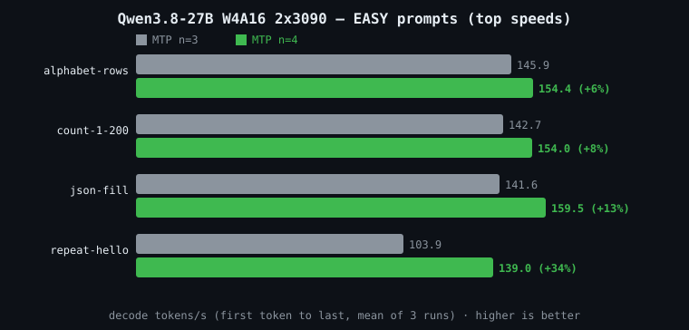
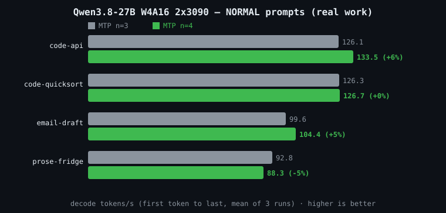

# Qwen3.8-27B AutoRound W4A16 on 2x RTX 3090

Production-oriented Docker deployment for [`Vishva007/Qwen3.8-27B-W4A16-AutoRound`](https://huggingface.co/Vishva007/Qwen3.8-27B-W4A16-AutoRound) on two 24 GB RTX 3090 GPUs.

The repository supports paired 3090s with NVLink and ordinary PCIe-only pairs. It exposes an OpenAI-compatible vLLM API with compiled CUDA graphs, speculative decoding, vision, structured tool calling, and separated reasoning.

## Two tiers, pick your drafter

The same W4A16 weights run under two speculative-decoding drafters. Both were validated on the same 2x RTX 3090 (NV4) host; both preserve the model output exactly, because speculative decoding only proposes tokens the target model then verifies.

- **Speed tier — DFlash2 (default / recommended).** A block-diffusion "keep drafting parallel" drafter (`incoai/Qwen3.8-27B-DFlash2`, `n=7`), the sibling successor to DFlash, ported from [vllm-project/vllm#52816](https://github.com/vllm-project/vllm/pull/52816). It took **#1 on our internal 69-scenario agent eval**. Best responsiveness; the trade is a heavier drafter, so a smaller KV pool and a lower safe context ceiling (see below). Recipe: [`recipes/speed-tier-dflash2/`](recipes/speed-tier-dflash2/).
- **Context tier — AutoRound + MTP (`n=4`).** The in-checkpoint MTP head. Lighter, so it keeps the full 262,144-token context and the larger KV pool. Reach for it when you need maximum context or maximum concurrent long-context streams. This is the profile the rest of this README documents.

### Head to head (measured, same box, same day)

| Metric | Speed tier · DFlash2 | Context tier · MTP n=4 |
|---|---:|---:|
| Drafter | DFlash2 `n=7` (block-diffusion, separate 3.6 GB checkpoint) | MTP `n=4` (in-checkpoint head) |
| vLLM image | `v0.27.1` + `vllm-dflash2` overlay | `qwen38-x86_64-cu129` |
| GPU memory utilization | 0.80 (heavy drafter) | 0.90 |
| **Max context (shipped default / max loadable)** | **131,072 / ~234,000** | **262,144** |
| **Logical KV pool** | **258,735 tokens** | **532,026 tokens** |
| Concurrency at max context | 1.97x @ 131K | 2.03x @ 262K |
| **Real-agent decode (69-scenario eval, single stream)** | **101.1 tok/s** | 77.8 tok/s |
| Structured-output decode (8-prompt easy mean) | **252.9 tok/s** | 157.3 tok/s |
| Code decode (quicksort + api mean) | **191.5 tok/s** | 141.2 tok/s |
| Free-prose decode (single stream) | 91.2 tok/s | 94.4 tok/s |
| Aggregate throughput (saturated, ~C2) | ~181 tok/s | ~180 tok/s |
| Median turn latency (eval) | **528 ms** | 812 ms |
| Our 69-scenario eval | **★★★★★ #1, 66/2/1, Quality 97.1, Deployability 97.9** | ★★★★★, 66/2/1, Quality 97.1, Deployability 97.5 |

**Read this (corrected):** an earlier version of this table said "decode is a wash." It is not. On the traffic agents actually send, DFlash2 decodes materially faster. On our 69-scenario agent eval (real prompts, tool calls, code, JSON) DFlash2 sustained **101.1 tok/s vs MTP4's 77.8** single-stream, a **+30%** decode win, and cut median turn latency to **528 ms vs 812 ms**. On a same-box same-day micro-benchmark it ran **+50 to +83% on structured output** (counting, JSON, repetition) and **+34 to +37% on code**, tied on email, and lost only **3% on free-form prose**, the one workload where a block-diffusion drafter has little to predict. The single number that IS a wash is saturated aggregate throughput: past about C2 both drafters hit the two 3090s' ~180 tok/s memory-bandwidth ceiling, so at full concurrency they converge. Model quality is identical either way (both 66 pass / 2 partial / 1 fail). DFlash2 is the default because it is genuinely faster per request on real agent work and took #1 on our board. The only thing you trade for it is the context ceiling, explained next.

### Why the KV pool and max context differ

The DFlash2 drafter is **heavy**: its two candidate-selector codebooks (~0.5 GiB per GPU) plus a five-layer backbone sit in VRAM alongside the 27B weights, and they eat the headroom the first prefill needs for activation buffers. To keep the first prefill from OOM-ing, the speed tier runs at `GPU_MEMORY_UTILIZATION=0.80` instead of 0.90. Lower utilization means a smaller KV cache — **258,735 logical tokens vs 532,026** — so we ship the speed tier at a **131,072** context ceiling rather than the model's native 262,144. The weights can address 262K, but the pool at 0.80 will not hold a full 256K sequence next to the drafter without risking a prefill OOM. If you need the full 262K context or the deepest concurrent-stream pool on **two** cards, use the context tier; if you want the top-ranked, snappiest agent server on two cards, use DFlash2. (Logical token counts are for the tensor-parallel engine, do not double them for two cards.)

**You can push the context higher on two cards if you need it (measured 2026-08-20).** The 131,072 ceiling is the deep-concurrency default, not a hard limit. The same TP=2 DFlash2 lane loads clean at **`MAX_MODEL_LEN=220000`** with a **235,492-token pool (1.07x concurrency at 220K)**; the real single-sequence ceiling is **~234,000** (235,000 crash-loops right at the pool edge, the engine's own reported safe max was 234,016). So on two cards you can trade concurrency for context up to ~234K when you need it. We keep **131,072 as the shipped default** because it holds the deeper **1.97x** concurrency pool, which matters more for an agent server than the last ~100K of single-sequence context.

**Have four 3090s?** The 131K cap is a two-card limitation, not a DFlash2 limitation. The companion repo [**Qwen3.8-27B-DFlash2-4x3090-TP4**](https://github.com/tonyd2wild/Qwen3.8-27B-DFlash2-4x3090-TP4) runs the exact same DFlash2 drafter across all four cards (TP=4). The four-card KV pool is **1,003,062 tokens, which holds 3.83 full 262,144-token sequences**, so on four cards you get DFlash2 speed AND the model's full native context with deep concurrency, no penalty. The only cost is a modest per-stream throughput drop (the four-way all-reduce has to cross PCIe between the two NVLink pairs). See that repo for the full TP=4 sweep.

## Verified reference result

The checked-in profile was validated on GPU 2/3 of a four-3090 host with an NV4 link. GPU 0/1 ran a separate model and were not touched.

| Setting | Verified value |
|---|---:|
| Model | Qwen3.8-27B AutoRound W4A16 |
| vLLM quantization | `inc` |
| Linear kernel | AutoGPTQ Marlin |
| Tensor parallelism | 2 |
| Context | 262,144 tokens |
| KV dtype | FP8 |
| KV allocation | 9.6 GiB per GPU |
| Logical KV pool | 532,026 tokens |
| 262K concurrency | 2.03x |
| GPU memory after startup | 22,154 MiB per GPU |
| Free GPU memory | 1,971 MiB per GPU |
| MTP draft length | **4 tokens** (was 3; see A/B benchmark below) |
| Restart/OOM count after verification | 0 / 0 |

Four forced 384-token single-stream checks measured 94.42, 97.23, 103.77, and 98.61 tokens/s. The three-run repeat average was **99.87 tokens/s**. Performance varies with prompt length, MTP acceptance, clocks, thermals, drivers, topology, and client overhead. These numbers measure speed, not model-quality equivalence to another quant.

## MTP3 vs MTP4 vs DFlash2: measured A/B on the same box

Two A/B runs on the same 4x3090 host, both single-stream decode (streamed, timed
first token to last, prefill excluded, thinking disabled, temperature 0.2):

1. **The original MTP sweep (immediately below).** GPU 0/1 serving MTP `n=3` and
   GPU 2/3 serving MTP `n=4`, to pick the MTP draft depth. `n=4` won and is the
   context-tier default.
2. **The DFlash2 comparison (further down).** A later same-day run on the same box,
   same censored AutoRound W4A16 weights, drafter the only variable: MTP `n=4` on
   one 3090 pair versus the DFlash2 `n=7` drafter on the other. This is the run that
   decided the speed tier.

The MTP `n=4` column appears in both runs; its absolute numbers differ a few percent
between the two days (clocks and thermals), so read each table's deltas against its
own baseline, not across tables.

**Easy prompts** (highly predictable output — this is where speculative
decoding shines, and where you see the top speeds):

| Prompt | MTP n=3 (tok/s) | MTP n=4 (tok/s) | Gain |
|---|---:|---:|---:|
| alphabet-rows | 145.9 | 154.4 | +6% |
| count-1-200 | 142.7 | 154.0 | +8% |
| json-fill | 141.6 | 159.5 | +13% |
| repeat-hello | 103.9 | 139.0 | +34% |



**Normal prompts** (real prose and code):

| Prompt | MTP n=3 (tok/s) | MTP n=4 (tok/s) | Gain |
|---|---:|---:|---:|
| code-api | 126.1 | 133.5 | +6% |
| code-quicksort | 126.3 | 126.7 | +0% |
| email-draft | 99.6 | 104.4 | +5% |
| prose-fridge | 92.8 | 88.3 | -5% |



**MTP sweep summary:** easy/structured mean **133.5 → 151.7 tok/s (+14%)** with a
best single run of **159.9 tok/s**; normal-work mean **111.2 → 113.2 (+2%)**, code up
~6%, free-form prose down ~5%. MTP `n=4` wins or ties everywhere that matters for agent
workloads, so `n=4` is the context-tier default (`NUM_SPECULATIVE_TOKENS=4`).

### DFlash2 n=7 vs MTP n=4 (fresh, same box, same day)

Same censored AutoRound W4A16 weights on both 3090 pairs; the drafter is the only
difference. This is the run that made DFlash2 the default speed tier.

**Easy prompts** (structured output, where the DFlash2 block-diffusion drafter's parallel proposals get accepted most):

| Prompt | MTP n=4 (tok/s) | DFlash2 n=7 (tok/s) | Gain |
|---|---:|---:|---:|
| count-1-200 | 163.4 | 262.9 | +61% |
| repeat-hello | 142.6 | 261.6 | +83% |
| alphabet-rows | 159.4 | 238.9 | +50% |
| json-fill | 163.8 | 248.0 | +51% |

**Normal prompts** (real prose and code):

| Prompt | MTP n=4 (tok/s) | DFlash2 n=7 (tok/s) | Gain |
|---|---:|---:|---:|
| code-quicksort | 144.9 | 199.1 | +37% |
| code-api | 137.5 | 183.9 | +34% |
| email-draft | 106.8 | 110.6 | +4% |
| prose-fridge | 94.4 | 91.2 | -3% |

**DFlash2 summary:** easy/structured mean **157.3 → 252.9 tok/s (+61%)**; normal-work
mean **120.9 → 146.2 (+21%)**, code up ~35%, email a tie, and free-form prose the lone
loss at -3%. Chained through the MTP sweep, the full ladder on structured output is
**MTP3 ~133 tok/s to MTP4 ~157 to DFlash2 ~253**. DFlash2 wins every structured and
code workload by a wide margin, which is why it is the repository's default drafter.
The only workload it does not win is pure free-form prose, where MTP `n=4` is marginally
ahead; if that is your entire workload, MTP `n=4` remains a fine choice.

Reproduce either run with `scripts/mtp-ab-bench.py` against any two endpoints
(`LABEL_A`/`ENDPOINT_A`, `LABEL_B`/`ENDPOINT_B`, `MODEL`).

### Cross-engine: DFlash2 (vLLM) vs DSpark (SGLang)

DFlash2 is not the only block-diffusion drafter for this model. SGLang has its own, **DSpark**.
On the same 8-prompt bench (same box, thinking-off, single-stream, 2026-08-20), it splits by
workload: DSpark is **~34% faster on pure structured/repetitive output** (counting, JSON,
repetition), while DFlash2 wins the mixed real-agent traffic (prose, email, free-form code, +5
to +20%) and ties on code. DFlash2 also keeps a far larger KV pool on the same two cards
(258,735 vs DSpark's ~116,611 / 3-request clamp), which is what makes it the better fleet server.
Full head-to-head with the numbers and both recipes:
[Qwen3.8-27B-SGLang-vs-vLLM-2x3090](https://github.com/tonyd2wild/Qwen3.8-27B-SGLang-vs-vLLM-2x3090).

## What is quantized

This checkpoint uses AutoRound W4A16: the main quantized weights are 4-bit and activations remain 16-bit. Its metadata uses `auto_round:auto_gptq` packing, and the tested vLLM image resolves it through `--quantization inc` to the Marlin AutoGPTQ kernel.

Selected sensitive layers, the vision components, and MTP tensors remain at higher precision by checkpoint design. The server uses BF16 compute and FP8 KV cache.

## Requirements

- Linux x86-64
- Two RTX 3090 24 GB GPUs
- Recent NVIDIA driver
- Docker Engine and NVIDIA Container Toolkit
- Python 3 and `curl`
- Hugging Face `hf` CLI for downloading
- At least 35 GB free before downloading weights and building caches
- A Qwen3.8-capable vLLM image; the verified image tag is the default in `.env.example`

## Quick start

Create your local configuration:

```bash
cp .env.example .env
chmod +x scripts/*.sh
```

Edit `.env`, especially `GPU_IDS`, `MODEL_DIR`, and `TOPOLOGY`. On the exact reference host, start from:

```bash
cp deployments/reference-4x3090-gpu2-3.env .env
```

Download and deploy:

```bash
./scripts/download-model.sh
./scripts/preflight.sh
./scripts/run.sh
./scripts/wait-ready.sh
python3 scripts/verify.py --benchmark-tokens 384
python3 scripts/benchmark.py --runs 3 --tokens 384
```

The default API is:

```text
http://SERVER_IP:8011/v1
model: qwen3.8-27b
context: 262144
```

## Exact serving behavior

The launch script intentionally enables:

- `--quantization inc` and BF16 compute;
- compiled execution and CUDA graphs; it does not use eager mode;
- four-token MTP speculative decoding (see the MTP3 vs MTP4 benchmark below);
- FP8 KV cache;
- `qwen3_xml` automatic tool parsing;
- `qwen3` reasoning parsing;
- thinking disabled by default;
- a 1,048,576-pixel image preprocessing ceiling;
- persistent vLLM and Triton caches.

The model's generation configuration currently supplies temperature `1.0`, top-k `20`, and top-p `0.95` when a client omits sampling values. Clients can explicitly send their own sampling configuration.

## NVLink versus PCIe

Use `TOPOLOGY=auto`, `nvlink`, or `pcie`.

With NVLink, `nvidia-smi topo -m` must show an `NV#` connection between the selected pair. The launch adds `--disable-custom-all-reduce`, selecting NCCL/PyNCCL tensor-parallel collectives. Despite its name, this does not disable NVLink; NCCL uses the available NVLink transport.

For PCIe-only pairs, the flag is omitted so vLLM can choose its supported custom collective. PCIe performance depends on slot/root-complex topology and peer-access support, so benchmark that host rather than assuming the NVLink result.

## API example

```bash
curl http://127.0.0.1:8011/v1/chat/completions \
  -H 'Content-Type: application/json' \
  -d '{
    "model":"qwen3.8-27b",
    "messages":[{"role":"user","content":"Reply with exactly OK"}],
    "temperature":0
  }'
```

## Operations

```bash
./scripts/status.sh
docker logs -f qwen38-autoround-int4
docker stop qwen38-autoround-int4
docker start qwen38-autoround-int4
```

To intentionally recreate the repository's own container after editing `.env`:

```bash
REPLACE_CONTAINER=1 ./scripts/run.sh
```

The script refuses replacement by default. For a cutover from another quant, follow [docs/CUTOVER.md](docs/CUTOVER.md) so the old container remains recoverable.

## Systemd

Create the container once with `scripts/run.sh`, then install the provided service. It assumes the repository is located at `/opt/qwen38-autoround-2x3090`:

```bash
sudo cp systemd/qwen38-autoround-int4.service /etc/systemd/system/
sudo systemctl daemon-reload
sudo systemctl enable qwen38-autoround-int4.service
sudo systemctl start qwen38-autoround-int4.service
```

## Documentation

- [**Speed tier — DFlash2 drafter (default, #1 on our eval)**](recipes/speed-tier-dflash2/)
- [Tuning](docs/TUNING.md)
- [Troubleshooting](docs/TROUBLESHOOTING.md)
- [Safe cutover and rollback](docs/CUTOVER.md)

## Repository layout

```text
.
|-- .env.example
|-- README.md
|-- deployments/
|   `-- reference-4x3090-gpu2-3.env
|-- docs/
|   |-- CUTOVER.md
|   |-- TROUBLESHOOTING.md
|   `-- TUNING.md
|-- scripts/
|   |-- benchmark.py
|   |-- download-model.sh
|   |-- lib.sh
|   |-- preflight.sh
|   |-- run.sh
|   |-- status.sh
|   |-- verify.py
|   `-- wait-ready.sh
|-- recipes/
|   `-- speed-tier-dflash2/   # SPEED TIER (default): DFlash2 drafter + vendored vllm#52816 overlay
`-- systemd/
    `-- qwen38-autoround-int4.service
```

## License

MIT
